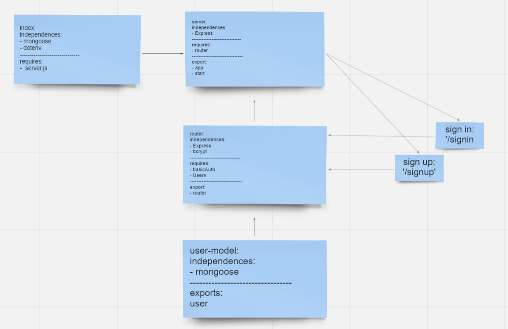

### basic-auth

# Lab: 06: Authentication

## Description
Express server that implements Basic Authentication, with signup and signin capabilities, using a Mongo database for storage.

### Phase 1:
##### create a new account so that can the user login later to access protected information: 

- Using a tool such as httpie, postman, or a web form:
Make a POST request to the/signup route with username and password

- Using a tool such as httpie, postman, or a web form:
Make a POST request to the /signin route

##### manually test your routes using httpie from the command line or an application such as Postman or Insomnia. 

## URL:

- Heroku app link:

https://m-basic-auth.herokuapp.com/

- GitHub actions link:

https://github.com/Batoolayyad/basic-auth/actions

- Pull Rrequest link:

https://github.com/Batoolayyad/basic-auth/pull/1

## UML
